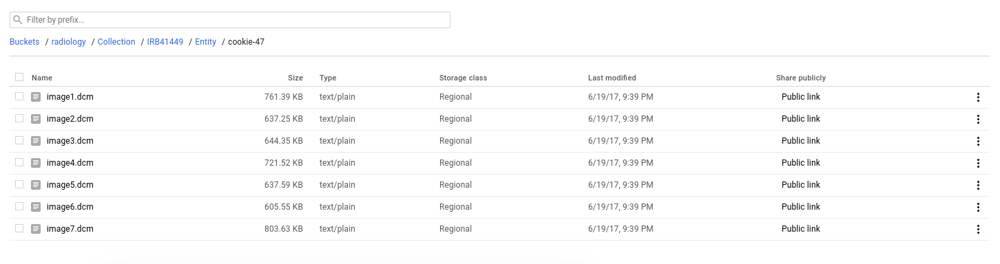
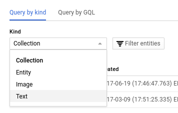
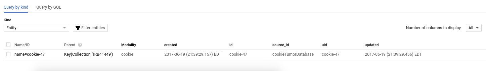
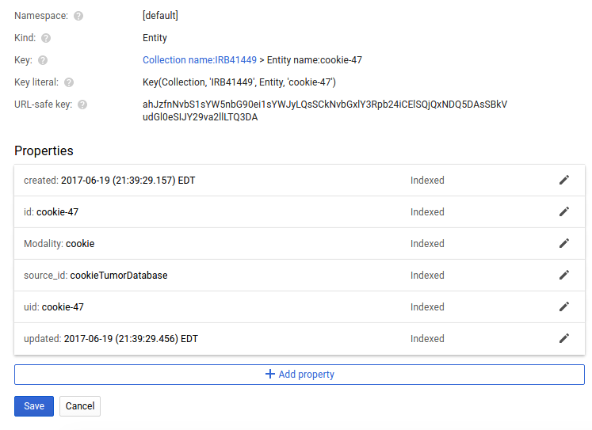
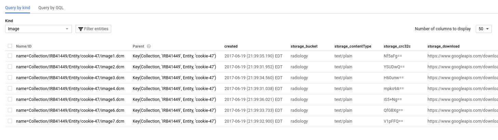
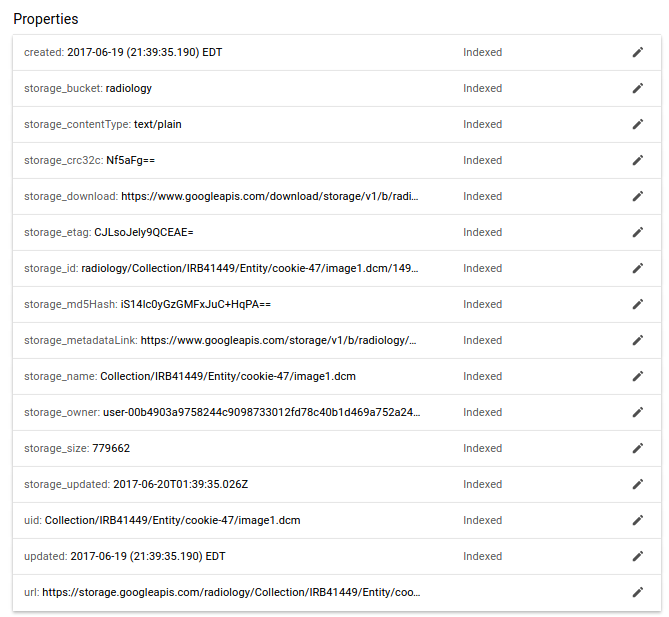
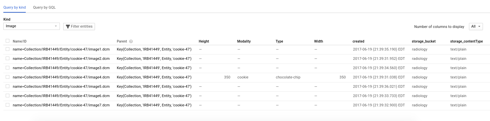

# Google Storage and Datastore
At this point, you've likely used the DASHER endpoint to de-identify (code identifiers with an alias) some dicom dataset, you've queried the endpoint using the [identifiers](identifiers.md) client, and now you want to move the data into storage. As a reminder, you will get back a data structure from DASHER that looks like this:

```
$ response

{'results': [{'id': '14953772',
   'id_source': 'Stanford MRN',
   'items': [{'id': 'MCH',
     'id_source': 'Lab Result',
     'jitter': 5,
     'jittered_timestamp': '2010-02-09T11:50:00-0800',
     'suid': '12fb'}],
   'jitter': 5,
   'jittered_timestamp': '1961-08-01T00:00:00-0700',
   'suid': '12fa'}]}
```

and it's up to you to parse over that data structure and use it to de-identify the headers (likely by formatting it and giving it to [deid](https://pydicom.github.io/deid) and then you will have a de-identified dataset for Google Storage and Google Datastore. Let's go through the steps of doing this upload.

## Credentials
In order to use any Google product, you need to have the variable `GOOGLE_APPLICATION_CREDENTIALS` pointing to a file with your [default application credentials](https://developers.google.com/identity/protocols/application-default-credentials) exported in the environment. It's not going to work if you don't. If you do this from within Python, you can do:

```
import os
os.environ['GOOGLE_APPLICATION_CREDENTIALS'] = "/home/vanessa/.topsecret/google"
```

you can also just export, for example, in your `~/.profile` or `~/.bashrc` or `~/.bash_profile`

```
GOOGLE_APPLICATION_CREDENTIALS=$HOME/.topsecret/google
export GOOGLE_APPLICATION_CREDENTIALS
```

## Google Storage and Datastore
We have storage an datastore coupled, so that Storage is the object store for images, and Datastore is the metadata place to query storage, and also have nice metadata about the images, entity, or collection to search.


### Client
You probably want to start by making a client. Do that like this:

```
from som.api.google.storage import Client
client = Client(bucket_name='radiology')
```

The client is named based on your bucket

```
$ client
storage.google.radiology
```

Next, it's important to understand the structure that we will be creating, specifically, a Collection (study) that has some number of entities (coded patients) each of which have some number of images. This is an object storage so these aren't technically file paths, but you can think of them as such:


```
Collection / [ collection name ]/ Entity / [ entity name ] / Images / [ image name ]
Collection / Study / Entity / SUID123 / Images / suid123-1.dcm
```

### Create a Collection
A collection is a logical grouping of entities, usually associated with something like a study, or for publishing, a journal. For our purposes, if we are interested in a clinical study, it might make sense to name it based on the IRB number.

```
collection = client.create_collection(uid='IRB41449')
```


### De-identify
This is largely up to you, but for the example let's load some dummy data from [deid](https://pydicom.github.io/deid):

```
from deid.data import get_dataset
from deid.dicom import get_files
dicom_files = get_files(get_dataset('dicom-cookies'))
```

And let's properly de-identify them!

```
from deid.dicom import get_identifiers, replace_identifiers

ids=get_identifiers(dicom_files)
DEBUG entity id: cookie-47
DEBUG item id: 1.2.276.0.7230010.3.1.4.8323329.5323.1495927169.335276
DEBUG Found 27 defined fields for image4.dcm
DEBUG entity id: cookie-47
DEBUG item id: 1.2.276.0.7230010.3.1.4.8323329.5354.1495927170.440268
DEBUG Found 27 defined fields for image2.dcm
DEBUG entity id: cookie-47
DEBUG item id: 1.2.276.0.7230010.3.1.4.8323329.5335.1495927169.763866
DEBUG Found 27 defined fields for image7.dcm
DEBUG entity id: cookie-47
DEBUG item id: 1.2.276.0.7230010.3.1.4.8323329.5348.1495927170.228989
DEBUG Found 27 defined fields for image6.dcm
DEBUG entity id: cookie-47
DEBUG item id: 1.2.276.0.7230010.3.1.4.8323329.5360.1495927170.640947
DEBUG Found 27 defined fields for image3.dcm
DEBUG entity id: cookie-47
DEBUG item id: 1.2.276.0.7230010.3.1.4.8323329.5342.1495927169.3131
DEBUG Found 27 defined fields for image1.dcm
DEBUG entity id: cookie-47
DEBUG item id: 1.2.276.0.7230010.3.1.4.8323329.5329.1495927169.580351
DEBUG Found 27 defined fields for image5.dcm

updated_files = replace_identifiers(dicom_files=dicom_files,
                                    ids=ids)
```

### Create an Entity
An entity within a collection corresponds to one patient. In this exanple above, we have 7 dicom images, but only for one patient. For example, here is his id in the `ids` data structure:

```
ids.keys()
dict_keys(['cookie-47'])
```

Let's make an entity for this cookie! First, we would have some loop or process to make a dictionary of metadata for the entity. This would correspond to things like a jittered date, or any custom fields you want stored with the entity. We recommend taking an approach that tries to answer the question "How would someone search for, and then find it?" We want to have meaningful fields and values that can answer that question. Some of the fields might come from the (de-identified) data that would be useful to search for, like study alias, image modality, etc. Here is an example:


```
metadata = { "source_id" : "cookieTumorDatabase",
             "id":"cookie-47",
             "Modality": "cookie"}
```

Then making the call coincides with creating a dataset. One Entity with images and metadata within a collection is considered a dataset.

```
client.upload_dataset(images=updated_files,
                      collection=collection,
                      uid=metadata['id'],
                      entity_metadata=metadata)
```

Once you do this, you will see the client spit out messages for the status of each image:

```
In [17]: client.upload_dataset(images=updated_files,
    ...:                       collection=collection,
    ...:                       uid=metadata['id'],
    ...:                       entity_metadata=metadata)

/tmp/tmpw109idvz/image4.dcm --> text/plain
DEBUG adding storage_download to Entity
DEBUG adding storage_etag to Entity
DEBUG adding storage_size to Entity
DEBUG adding storage_owner to Entity
DEBUG adding storage_metadataLink to Entity
DEBUG adding storage_contentType to Entity
DEBUG adding storage_bucket to Entity
DEBUG adding storage_updated to Entity
DEBUG adding storage_name to Entity
DEBUG adding storage_crc32c to Entity
DEBUG adding storage_md5Hash to Entity
DEBUG adding storage_id to Entity
DEBUG IMAGE: <Key('Collection', 'IRB41449', 'Entity', 'cookie-47', 'Image', 'Collection/IRB41449/Entity/cookie-47/image4.dcm'), project=som-langlotz-lab>

...

/tmp/tmpw109idvz/image5.dcm --> text/plain
DEBUG adding storage_download to Entity
DEBUG adding storage_etag to Entity
DEBUG adding storage_size to Entity
DEBUG adding storage_owner to Entity
DEBUG adding storage_metadataLink to Entity
DEBUG adding storage_contentType to Entity
DEBUG adding storage_bucket to Entity
DEBUG adding storage_updated to Entity
DEBUG adding storage_name to Entity
DEBUG adding storage_crc32c to Entity
DEBUG adding storage_md5Hash to Entity
DEBUG adding storage_id to Entity
DEBUG IMAGE: <Key('Collection', 'IRB41449', 'Entity', 'cookie-47', 'Image', 'Collection/IRB41449/Entity/cookie-47/image5.dcm'), project=som-langlotz-lab>
```

Note that the data type is detected as text/plain, and if there is a preferable data type to specify, we can change this. We need functions for this, please see [this issue](https://github.com/vsoch/som/issues/18). There shouldn't be any change in the data itself, this is more for sending the data, and all seems to have gone ok. If you want to change the verbosity of the debugger, export the variable `MESSAGELEVEL` to one of `DEBUG`, `QUIET`, `VERBOSE`, or an integer between -5 (only show the most severe errors) to 0 (quiet) to 5 (debug). 


### Viewing on Google Cloud

#### Storage
Then if you were to go to the [Google Cloud](https://console.cloud.google.com/) storage interface, you would see all of the images!



Notice that the bucket has storage class Regional, and there is a public link that you can share. Uploads to storage can have custom permissions levels, and this can be set or changed via the [Storage API](https://cloud.google.com/storage/docs/json_api/v1/). We likely should have defaults / functions to do this for som tools as well.

How do we know they are there, or how to link and search them? This is possible with the [Storage API](https://cloud.google.com/storage/docs/json_api/v1/) but parsing over every single object isn't an optimal way to quickly query this kind of data. This is why we use Google Datastore for the metadata. 

#### Datastore
Datastore is a non relational database, optimized for querying over large data, and data that doesn't conform to a specific set of fields. Each object (called an Entity) has a particular type, and if you go to the Datastore console, you can see the types that we have defined (based on the [wordfish-standard](https://www.github.com/vsoch/wordfish-standard) are `Collection`, `Entity`, and `Images` and `Texts`.

 


We can look at the details of our collection, and see that it's key follows the format of `Collection/IRB4149`

 

We can then look at our entities, for which we only have one, `cookie-47`:

 

Notice how the metadata fields we added are present? If we look closer by clicking on it, we also see that they are indexed:

 

And note that the full key for this entity would thus be `Collection/IRB41449/cookie-47`

And now we drill deeper to the level of the images, and see (arguably) the most important unit of data, the images:



Importantly, notice the fields relevant to Google Storage? Every single image carries with it multiple metadata about its storage. One of links goes to the full json view of the object in storage with absolutely every field that exists, and the rest are redundant, but provided to avoid the extra query.



Thus, although we could parse over Google Storage programmatically to look at file names, having the metadata searchable in this scalable non relational database is a good strategy for applications. It also allows for a separation between the image data and the metadata about it, if the need ever arises for having different permissions between the two. 

What you didn't see is that the client is performing the operations to storage and datastore in batches, as opposed to one request per image. You might also be wondering "How do we add metadata on the level of the images? 

### Adding Metadata to Images
The above example adds metadata for the entity, but not on the level of images, and this was to keep the first example simple. To add metadata to images, you can simply generate a data structure that has keys corresponding to the image file paths, and then each value is the same kind of metadata dictionary. For example:

```
images_metadata = {
                    "/tmp/tmp16zatloc/image4.dcm":
                           
                              {
                               "Modality":"cookie",
                               "Type": "chocolate-chip",
                               "Width": 350,
                               "Height": 350
                              }
                   }
```

When you add these fields, remember that it's important to put yourself in the head of the researcher. What and how would I want to query? I'd probably be interested in Modality, and image size and resolution, for example, but I wouldn't care so much for the oven brand it was cooked in (or maybe I would?).

You could then do almost the same call, but adding the metadata for the images. Let's use metadata for one image, but include all of them. Note how the image path matches the key in the `images_metadata`:

```
updated_files[0]   # '/tmp/tmp16zatloc/image4.dcm'  
client.upload_dataset(images=updated_files,
                      collection=collection,
                      uid="cookie-47",
                      images_metadata=images_metadata)
```

Now we can look again at storage, and we see that the image (`image4.dcm`) has fields added (and the others, that we didn't provide anything for, do not). 



We can also see more detail by looking at the image. 


Note that while I'm looking at these in the web interface, these are all programatically queryable and accessible from Python, or even with Google Query Language directly in your browser. Pretty neat!

If you are interested in this full example as a script, see [upload_storage_radiology.py](https://github.com/vsoch/som/blob/master/examples/google/radiology/upload_storage_radiology.py)

### Keys
It's important to note that the language of Datastore is based on the idea of a key. We've been talking about the full path that includes the Collection, Entity, and Image, and this is exactly what the key looks like:

```
 Collection name:IRB41449 > Entity name:cookie-47 > Image name:Collection/IRB41449/Entity/cookie-47/image4.dcm
```

This key is essential for referencing an entity directly in queries. In the example above, the last part of the key is the Entity itself, and we can see that it is type `Image`. and it's name (the full key) is the string that includes the Collection and Entity, `Collection/IRB41449/Entity/cookie-47/image4.dcm`. The content before that is known as the Ancestor path, or other Entities that are extended (in path) to get to the child entity. This also means that the names of the files are important. If I have two images of the same name, under the same collection, and the same Entity, this will reference the same record in datastore.  

Your key also has a representation for Google Query Language:

```
Key(Collection, 'IRB41449', Entity, 'cookie-47', Image, 'Collection/IRB41449/Entity/cookie-47/image4.dcm')
```

Along with a "URL-safe key" that has been byte64 encoded. Please note this key is **not** encrypted, if that matters for where you use it.

``` ahJzfnNvbS1sYW5nbG90ei1sYWJyZwsSCkNvbGxlY3Rpb24iCElSQjQxNDQ5DAsSBkVudGl0eSIJY29va2llLTQ3DAsSBUltYWdlIi9Db2xsZWN0aW9uL0lSQjQxNDQ5L0VudGl0eS9jb29raWUtNDcvaW1hZ2U0LmRjbQw
```
